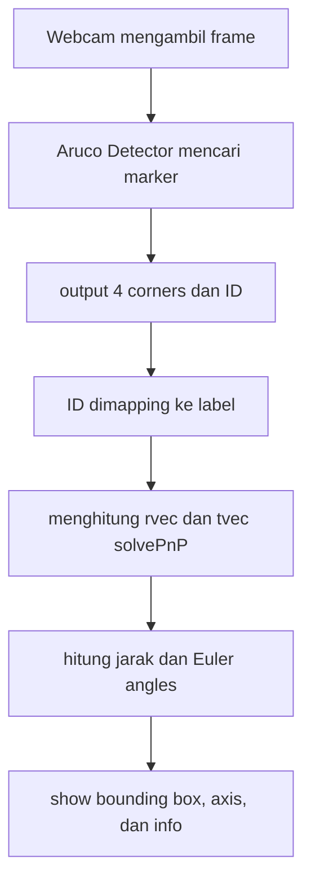

# ArUco Marker Detection dan Pose Estimation

## 1. Apa ini

ArUco Marker Detection dan Pose Estimation

## 2. Dict Marker

Dictionary yang digunakan adalah `DICT_4X4_50`.

|  ID | Label             |
| --: | ----------------- |
|   0 | Standby           |
|   1 | Target Autonomous |
|   2 | Lepas             |
|   3 | Putar CW          |
|   4 | Putar CCW         |

## 3. Struktur File

```text
./
├── detect_markers.py
├── README.md
├── requirements.txt
├── udp_sender.py
├── udp_recv_test.py
├── pose_filter.py
└── calibration/
    ├── calibrate_camera.py
    └── camera_calibration.yml
```

File `camera_calibration.yml` dibuat oleh
`calibrate_camera.py`.

## 4. Instalasi

```bash
pip install -r requirements.txt
```

## 5. Kalibrasi Kamera

Menggunakan checkerboard dengan:

- 9 x 6 sudut dalam;
- 10 x 7 kotak fisik;
- ukuran satu kotak 25 mm.

Jalankan:

```bash
python calibrate_camera.py
```

Cara mengambil sampel:

1. Arahkan checkerboard ke kamera.
2. Pastikan tulisan `TERDETEKSI` muncul.
3. Tekan `s` untuk menyimpan satu sampel.
4. Pindahkan, dekatkan, jauhkan, dan miringkan checkerboard.
5. Ulangi sampai terkumpul 15 sampel.

Hasil kalibrasi disimpan pada
`calibration/camera_calibration.yml`.

## 6. Menjalankan Deteksi

Gunakan marker `DICT_4X4_50` dengan panjang sisi hitam tepat 100 mm atau 10 cm.

```bash
python detect_markers.py
```

Tekan `q` untuk menutup program.

Output yang ditampilkan:

- bounding box marker;
- ID dan label;
- sumbu X, Y, dan Z;
- jarak marker dalam sentimeter;
- roll, pitch, dan yaw dalam derajat;
- informasi yang sama pada terminal.

## 7. FLow program



## 8. Penjelasan (makasih claude udah jelasin)

### 8.1 Pinhole camera model

Relasi antara titik 3D dan pixel di gambar:

$$
s
\begin{bmatrix}
u \\
v \\
1
\end{bmatrix}
=
K
\begin{bmatrix}
R & t
\end{bmatrix}
\begin{bmatrix}
X \\
Y \\
Z \\
1
\end{bmatrix}
$$

- $(X,Y,Z)$: titik marker di world coordinate
- $(u,v)$: posisi titik itu di image plane
- $s$: scale factor
- $K$: camera matrix
- $R$: rotation matrix
- $t$: translation vector

Camera matrix:

$$
K=
\begin{bmatrix}
f_x & 0 & c_x \\
0 & f_y & c_y \\
0 & 0 & 1
\end{bmatrix}
$$

$f_x, f_y$ = focal length (pixel), $c_x, c_y$ = optical center. Semua ini
didapat dari hasil kalibrasi.

### 8.2 Lens distortion

Lensa bikin garis lurus keliatan melengkung. Distortion coefficients yang
dipakai:

$$
(k_1,k_2,p_1,p_2,k_3)
$$

$k_1, k_2, k_3$ untuk radial distortion, $p_1, p_2$ untuk tangential
distortion. Disimpan sebagai `dist_coeffs`.

### 8.3 Marker coordinates

Marker = persegi datar dengan sisi:

$$
L = 0.045 \text{ m}
$$

Center marker di $(0,0,0)$, empat corner-nya:

$$
P_0=(-L/2, L/2, 0) \quad
P_1=(L/2, L/2, 0) \quad
P_2=(L/2, -L/2, 0) \quad
P_3=(-L/2, -L/2, 0)
$$

Karena marker datar, $Z$ selalu 0.

### 8.4 Pose estimation with solvePnP

Detector kasih empat titik di gambar, dan kita udah tahu posisi asli empat
titik itu di dunia nyata. `solvePnP` mencari $R$ dan $t$ yang bikin proyeksi
titik dunia nyata paling deket sama titik yang kedeteksi kamera untuk meminimalkan reprojection error:

$$
E(R,t)=\sum_{i=0}^{3}
\left\|p_i-\hat{p}_i(R,t)\right\|^2
$$

$p_i$ = corner yang terdeteksi, $\hat{p}_i$ = hasil proyeksi dari tebakan
$R, t$.

Dipakai `SOLVEPNP_IPPE_SQUARE` karena objeknya persis satu persegi datar
dengan 4 titik.

### 8.5 Translation vector & distance

$$
t=
\begin{bmatrix}
t_x \\ t_y \\ t_z
\end{bmatrix}
$$

$t_x$ = horizontal, $t_y$ = vertical, $t_z$ = depth (jarak ke arah depan
kamera).

Jarak ke marker dihitung pakai Euclidean norm:

$$
d=\sqrt{t_x^2+t_y^2+t_z^2}
$$

Contoh, $t=(0.03,-0.02,0.80)$ m:

$$
d=\sqrt{0.03^2+(-0.02)^2+0.80^2}\approx0.801\text{ m}=80.1\text{ cm}
$$

Satuan `tvec` ikut satuan koordinat marker (meter), makanya dikali 100 buat
dapet cm.

### 8.6 Rotation vector & Euler angles

`solvePnP` juga ngasih `rvec` (axis-angle representation) atau arah vektornya
= axis rotasi, panjangnya = besar rotasi:

$$
\theta=\sqrt{r_x^2+r_y^2+r_z^2}
$$

`cv2.Rodrigues()` mengubah `rvec` jadi rotation matrix $R$, lalu ubah
jadi roll (X), pitch (Y), yaw (Z).

$$
\theta_{deg}=\theta_{rad}\cdot\frac{180}{\pi}
$$

Roll/pitch/yaw di sini ngikutin OpenCV axis convention, bukan arah kompas.

### 8.7 Calibration reprojection error

Kualitas kalibrasi dicek dengan membandingkan checkerboard corner yang
kedeteksi vs hasil proyeksinya:

$$
RMSE=\sqrt{
\frac{1}{N}
\sum_{i=1}^{N}
\left\|p_i-\hat{p}_i\right\|^2
}
$$

Makin deket ke 0, makin bagus.

## 9. Penjelasan Sumbu 3D

Sumbu yang digambar OpenCV:

- X berwarna merah;
- Y berwarna hijau;
- Z berwarna biru.
