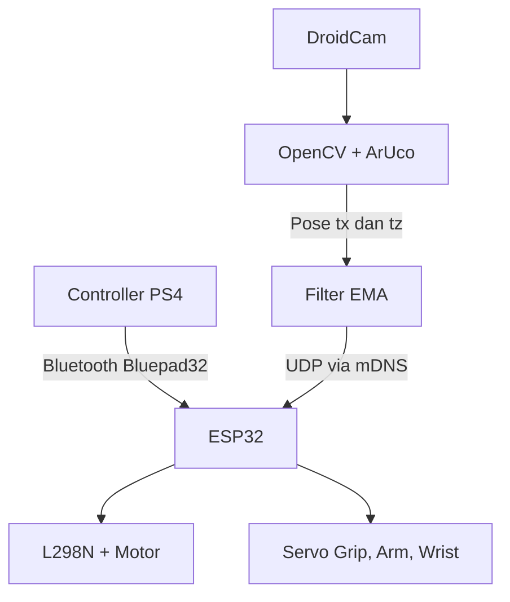

# Arsitektur Sistem

## Alur keseluruhan

ESP32 menjalankan satu state machine dengan dua mode. Segitiga mengubah mode,
tetapi emergency stop selalu memiliki prioritas tertinggi. Wi-Fi tidak aktif
pada mode Manual. Di mode Autonomous, Wi-Fi menggunakan minimum modem sleep
dan coexist dengan Bluetooth agar tombol controller tetap dapat dibaca.

## Urutan `setup()`

1. Servo diinisialisasi; MG90S grip menuju posisi terbuka penuh.
2. Pin motor disiapkan dan motor masuk kondisi brake.
3. Bluepad32 didaftarkan untuk menerima callback connect/disconnect.
4. Kredensial Wi-Fi diperiksa, tetapi radio Wi-Fi tetap mati pada mode awal Manual.
5. Jika konfigurasi simulasi meminta start Autonomous, Wi-Fi baru dinyalakan.

## Urutan `loop()`

1. `BP32.update()` memperbarui data controller.
2. Tombol edge-detected diproses: Cross, Circle, dan Segitiga.
3. Pada Autonomous, status Wi-Fi dan mDNS diperbarui.
4. Semua paket UDP yang tersedia dibaca.
5. Emergency stop diperiksa.
6. Mode Manual atau Autonomous dihitung.
7. Status ringkas dicetak berkala.

## Prioritas keselamatan

| Prioritas | Kondisi | Respons |
|---:|---|---|
| 1 | Emergency stop aktif | Brake kedua motor |
| 2 | Controller putus pada mode Manual | Brake kedua motor |
| 3 | Wi-Fi/pose UDP hilang pada mode Autonomous | Brake kedua motor |
| 4 | Marker sudah mencapai jarak berhenti | Brake kedua motor |
| 5 | Kondisi normal | Jalankan hasil mixer/P-controller |

## Modul firmware

| Modul | Tanggung jawab |
|---|---|
| `bluepad_input` | Pairing Bluepad32, pembacaan axis/trigger, edge detection tombol |
| `motor_driver` | Arah, PWM, pembalikan motor, dan brake |
| `servo_controller` | Grip analog R2 serta arm/wrist |
| `network_manager` | Start/stop Wi-Fi, minimum modem sleep, reconnect, dan mDNS |
| `udp_receiver` | Parsing dan validasi paket pose |
| `autonomous_controller` | Mengubah `tx,tz` menjadi PWM kiri/kanan |
| `robot_controller` | State machine dan integrasi semua modul |

## Alur Manual

- Stick kiri menghasilkan throttle dan steering.
- Mixer differential drive menghitung motor kiri dan kanan.
- L2 mengalikan PWM dengan skala `0..1` dan menjadi full brake di ujung tekanannya.
- R2 dipetakan langsung ke rentang sudut grip.
- Stick kanan menggeser arm dan wrist secara bertahap.

## Alur Autonomous

1. Segitiga membuat motor brake dan menyalakan Wi-Fi.
2. `WiFi.setSleep(true)` mengaktifkan `WIFI_PS_MIN_MODEM` untuk coexistence.
3. Setelah Wi-Fi terhubung, mDNS dan UDP receiver dimulai.
4. Vision mengirim `tx` dan `tz` marker ID 1.
5. Sudut target dihitung dengan `atan2(tx, tz)`.
6. Jika sudut terlalu besar, robot berputar di tempat.
7. Jika sudah sejajar, robot maju sambil mengoreksi arah.
8. Jika `tz <= 0,25 m`, motor direm.
9. Jika paket tidak diterima selama lebih dari 300 ms, motor direm.

Grip dan servo mekanik lain tidak digerakkan oleh autonomous.
