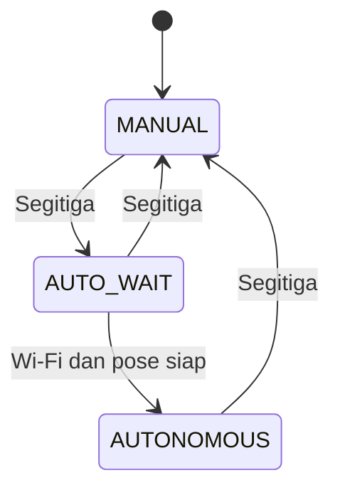

# Switch Mode Manual dan Autonomous

## Keputusan desain

Mode default robot adalah `MANUAL`. Pada mode ini Bluepad32 aktif dan Wi-Fi
dimatikan. Tombol Segitiga mengubah mode kendali secara dinamis dari dalam
`loop()`.

Bluetooth tidak dimatikan ketika masuk `AUTONOMOUS`. Alasannya sederhana:
kalau Bluetooth dimatikan, controller PS4 terputus sehingga tombol Segitiga,
Cross, dan Circle tidak dapat digunakan lagi. Karena itu mode Autonomous
menggunakan Wi-Fi dan Bluetooth bersamaan dengan mekanisme coexistence ESP32.



| State | Bluetooth | Wi-Fi | Motor |
|---|---|---|---|
| `MANUAL` | Aktif | Mati | Dikendalikan stick PS4 |
| `AUTO_WAIT` | Aktif | Aktif + modem sleep | Brake |
| `AUTONOMOUS` | Aktif | Aktif + modem sleep | Dikendalikan pose UDP |

`AUTO_WAIT` bukan enum terpisah di source. Secara implementasi robot sudah
berada di `AUTONOMOUS`, tetapi fungsi `updateAutonomous()` mempertahankan brake
selama Wi-Fi atau pose UDP belum valid.

## Mengapa Wi-Fi dan Bluetooth tidak harus saling mematikan

ESP32 hanya memiliki satu radio 2,4 GHz, tetapi ESP-IDF menyediakan coexistence
yang membagi waktu penggunaan radio antara Wi-Fi dan Bluetooth. Masalah pada
versi sebelumnya berasal dari baris berikut:

```cpp
WiFi.setSleep(false);
```

Nilai `false` memilih `WIFI_PS_NONE`. Pada revisi ini baris tersebut diganti
menjadi:

```cpp
WiFi.setSleep(true);
```

Pada Arduino-ESP32, nilai `true` dipetakan ke `WIFI_PS_MIN_MODEM`. Wi-Fi tetap
terhubung ke access point, tetapi radio Wi-Fi tidur di luar slot yang diperlukan
dan memberi ruang lebih baik untuk Bluetooth. Paket UDP mungkin mengalami
sedikit tambahan latency sesuai siklus DTIM, sehingga timeout pose tetap dipakai
sebagai pengaman.

## Urutan masuk Autonomous

Fungsi `RobotController::setMode()` menjalankan transisi berikut:

1. `motors.brake()` menghentikan robot sebelum perubahan radio.
2. `udp.stop()` membersihkan receiver dan pose lama.
3. State diubah ke `AUTONOMOUS`.
4. `NetworkManager::start()` mengaktifkan `WIFI_STA`.
5. `WiFi.setSleep(true)` mengaktifkan minimum modem sleep.
6. ESP32 mulai terhubung ke SSID tanpa loop tunggu yang memblokir controller.
7. Setelah mendapat IP, mDNS `gmrt-heroes-2.local` diaktifkan.
8. UDP port 4210 mulai mendengarkan.
9. Motor baru boleh bergerak setelah paket pose marker masih fresh.

Koneksi dilakukan non-blocking: tidak ada `while` yang menunggu Wi-Fi di sketch
utama. `NetworkManager::update()` memeriksa status setiap putaran `loop()` dan
mencoba ulang secara berkala. Karena `BP32.update()` tetap dipanggil, controller
masih responsif selama Wi-Fi sedang menyambung.

## Urutan kembali ke Manual

Ketika Segitiga ditekan lagi:

1. Motor langsung brake.
2. UDP receiver dihentikan.
3. mDNS dihentikan.
4. Auto reconnect Wi-Fi dimatikan.
5. Wi-Fi diputus dan radio Wi-Fi dimatikan.
6. State kembali `MANUAL`; Bluepad32 tidak pernah dihentikan.

## Jika ingin radio benar-benar eksklusif

Skema `Bluetooth OFF` pada Autonomous memang menghilangkan coexistence, tetapi
Segitiga tidak bisa lagi menjadi toggle dua arah. Untuk kembali ke Manual harus
ada salah satu jalur lain:

- tombol fisik pada GPIO;
- perintah UDP dari laptop;
- timeout otomatis lalu restart ESP32; atau
- sakelar daya/reset.

Selain itu, memanggil fungsi internal `esp_bt_controller_deinit()` saat Bluepad32
masih memiliki callback dan object controller berisiko merusak state Bluetooth.
Karena Bluepad32 tidak memerlukan shutdown untuk desain ini, firmware tidak
melakukan deinit Bluetooth secara paksa.

## Cara menguji tanpa motor

1. Set `ROBOT_SIMULATION=1`.
2. Biarkan `START_IN_AUTONOMOUS=false`.
3. Upload firmware dan buka Serial Monitor 115200.
4. Pair controller PS4. Pastikan status Manual menunjukkan `wifi_active=0`.
5. Tekan Segitiga satu kali.
6. Pastikan muncul `Wi-Fi power save: WIFI_PS_MIN_MODEM` dan proses koneksi.
7. Selama belum ada pose UDP, pastikan PWM tetap `0/0`.
8. Jalankan `vision/tools/udp_pose_simulator.py` dan amati nilai PWM simulasi.
9. Tekan Segitiga lagi dan pastikan Wi-Fi berhenti serta Manual aktif kembali.

Jika controller putus ketika Wi-Fi mulai, pastikan tidak ada lagi
`WiFi.setSleep(false)` di project, gunakan hotspot 2,4 GHz, dan uji dengan board
package ESP32 + Bluepad32 yang sesuai dengan board ESP32 klasik.
